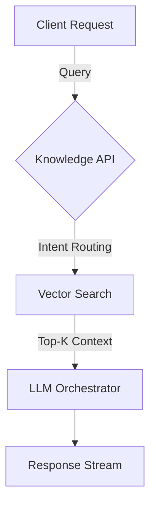

# AI Project Knowledge Platform

Building a knowledge platform that mixes retrieval augmented generation with task-specific workers.

## Highlights

- Designed ingestion workers that split multi‑gigabyte PDFs into embeddable chunks
- Built streaming evaluators to keep the feedback loop under 1 minute
- Owned 100% of the RAG infra plus 20% of the Knowledge API surface

