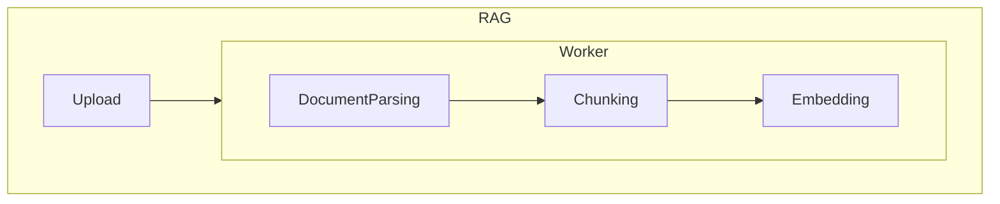
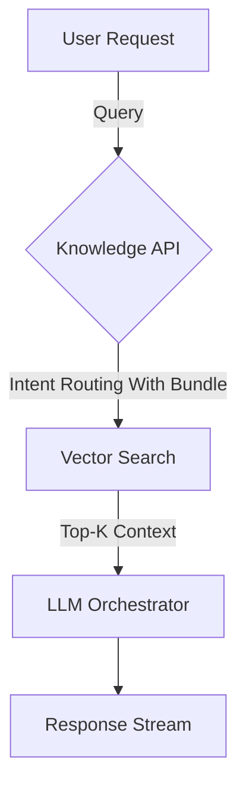

# AI Project - Knowledge-Based Service

Built a knowledge-based service that enables organizations to utilize collections of knowledge sources by connecting FastAPI for handling file upload requests and an indexing (Embedding) pipeline using Python/Celery.

The project's main components consisted of RAG (Python) / Knowledge API (Kotlin) / FE (TypeScript), with 4 team members including myself participating in the implementation.

## Key Points

- Tuning process for resource efficiency: After identifying issues, conducted 3 days of tuning including weekends before release
  - Before attaching a billing system, researched, analyzed, and evaluated various open-source tools (9 types) for markdown interpretation of documents (especially PDFs)
  - For PDFs, random access is required (Mmap Optimization), making simple streaming processing difficult, leading to various optimizations for memory tuning across the entire project
  - Focused on CPU/Memory for cost reduction in limited resources, utilizing K8s Ephemeral Container profiling
  - Established tuning hypotheses based on C++ memory management experience (+ CS knowledge, game server knowledge), and iterated through verification and improvement processes
- Instead of simply parsing/chunking/embedding entire files, read up to the chunk size to process from the stream (game server experience), buffering while balancing performance and memory according to buffer size based on proven tuning
  - Although not extensively tested, achieved processing speed similar to or better than BedRock Foundation model
- Verification using an evaluation system rather than just "seems to work"
  - Evaluation system: [deepeval](https://github.com/confident-ai/deepeval)

| Metric | Desc | threshold |
| --------------------- | ------------------------------------------------------ | --------- |
| Contextual Precision | Whether the obtained context is accurate and important | 0.5 |
| Contextual Recall | Whether the obtained context contains relevant information | 0.5 |
| Answer Relevance | Evaluation of relevance to user's query | 0.5 |
| Faithfulness | Whether the generated response actually matches the context of the provided response | 0.5 |

Achieved 80% correctness evaluation based on deepeval's 50% threshold metric.

- Directly developed RAG infrastructure 100%, Knowledge API 20%
  - Knowledge API was primarily reviewed, and changes requested in reviews were about code quality, not personal preferences.

indexing

search

