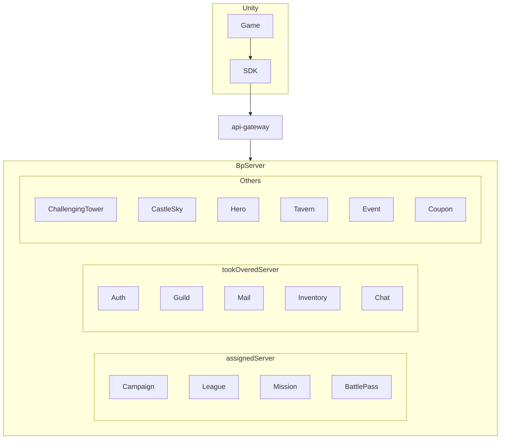

# BrownDust Puzzle

A 3 Match puzzle RPG game utilizing Neowiz's Brown Dust IP.

At the time, Neowiz Games wanted to build a new platform to reuse experiences for parts that could be commonly used in game servers, such as:

- Common functions like login/authentication
- Generally necessary functions like store and coupon services
- SDK that communicates with servers through simple method/function calls
- Platform where game-specific logic can be replaced pluggably

Since there were also content elements, development proceeded as a new game project's server developer based on internal judgment that developing around the platform would make it difficult to use in actual games.

Directly developed game content. In this process, multiple MSA servers were developed, and `approximately 20` services were operated for this game.

There were 3 backend developers including myself, and since I was also responsible for the SDK (For Unity), I handled platform communication in addition to communicating content logic with other team members.

## Key Points

- `Automatically generated SDK methods by analyzing server code (Roslyn Code Analysis)`, Unity game developers could communicate with servers by attaching the SDK to Unity and calling provided methods

- Developed game content for assigned features (Especially League)
  - Campaign refers to general stage-based game play/clear functionality
  - League refers to functionality that forms user pools matching each user's league at specific times, matches users within that user pool when users participate in league battles, calculates victory points, and reconfigures user leagues to repeat

- Also contributed to `DevOps` role. Modified/utilized existing dev environment's Terraform configuration to configure new Stage (QA) environment and maintain other environments (This project was the second project with significant DevOps weight)

<!--  -->

