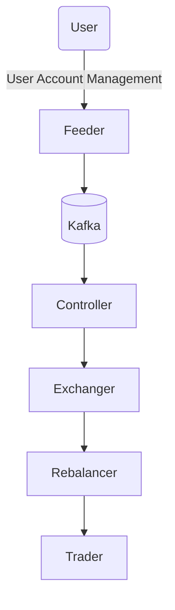

# Robo Advisor Trading Service

Developed a robo advisor trading service that passed RATB, a profitability indicator for stock trading.

The existing service was batch-based and couldn't properly handle HTS events that occurred freely outside the app, causing various errors. To solve this, I was internally scouted as someone who could resolve this among existing in-house personnel (As `PL`). Heybit -> dndn

The main services of the newly architected project were Feeder, Controller, Rebalancer, Trader, and Exchanger, each architected and implemented to perform roles corresponding to their names (Single Responsibility). Initially, except for Feeder, the remaining services were quickly implemented as monolithic, and migration to MSA for Single Responsibility was simply code migration and adding services to already well-established DevOps (since Uprise recognized foundational knowledge, I had some DevOps authority), so service separation was completed in `less than a day per service`. (This was before AI Code Assistant help)

The project involved approximately 8 developers.

## Key Points

- Addressing issues where batch-based processing couldn't handle user HTS events that occurred between request time and processing time
- Addressing issues where asset changes couldn't be properly handled due to asset changes between processing time and request time by building a new architecture
- Processing according to various user account change events
- Implementing rebalancing functionality for user asset portfolios
- Implementing common modules to be used across services

