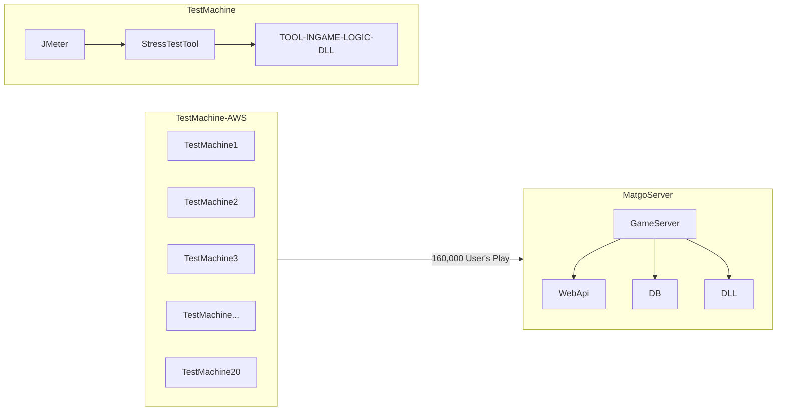

# Realtime Game Server / Company-Wide Infrastructure Migration Project

A project to migrate all servers of Neowiz Group that were running in On-Premise environments to Cloud environments. Participated as Co-PL for the migration of mobile web board server platforms that held significant revenue share at Neowiz at the time. Since I was the Main Contributor of these game servers before this project, I had comprehensive knowledge about what parts needed modification and how integration testing should proceed, so I utilized metrics previously collected from actual operating users to configure/implement dynamic scenarios with patterns/traffic that users actually play.

Since these were stateful game servers, actual user traffic patterns could significantly impact actual operation, so this analysis was necessary. Some game server content logic was configured as Web API, but socket-based communication was required, and actual game room logic was configured as DLL, making analysis impossible with general stress testing tools. Therefore, I also directly implemented a distributed stress testing tool.

The web board infrastructure migration project involved approximately < 200 personnel, and I participated as `Co-PL`. Was 100% responsible for gameplay-related verification.

To ensure that actual traffic loads could enable 'normal' gameplay on the new infrastructure, MCU (concurrent users) 160,000 traffic was run in the stress testing tool.

During test environment configuration, there were also issues like clients not being able to handle loads since large traffic needed to be injected, but resolved issues within schedule through JMeter usage pattern analysis and stress testing tool profiling (Context Switch Issue). Also directly analyzed and resolved causes of these issues.

