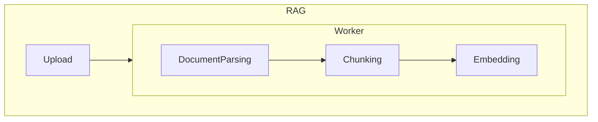
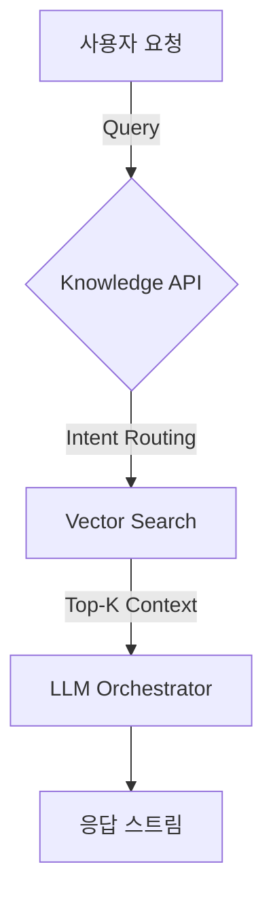

# AI 프로젝트 지식 기반 서비스

Python / Celery 를 이용하여 파일 업로드 등의 요청을 받는 FastApi 와 indexing (Embedding) Pipeline 을 엮고, 지식 소스들의 묶음을 조직별로 활용할 수 있는 지식 기반 서비스를 구축했습니다.

프로젝트의 주요 컴포넌트는 RAG(Python)/Knowledge Api(Kotlin)/FE(TypeScript) 로 구성되어 있었으며,
본인 포함 실무 참여 인원은 4명 입니다.

## 주요 포인트

- 리소스 효율화를 위한 튜닝 프로세스, 이슈 상황 확인 후 주말을 포함한 3일간의 튜닝을 거쳐 릴리즈
  - 과금 체계를 붙이기 전, document (특히 PDF)의 markdown 해석을 위한 각종 오픈소스 (9종) 에 대한 리서치와 분석, 평가
  - PDF 의 경우 Random Access 가 필요하므로, (Mmap Optimization) 단순 스트리밍 처리가 어렵고, 이에 따라 프로젝트 전체에 메모리 튜닝을 위한 각종 최적화
  - 한정된 리소스에서 비용 절감을 위해 CPU / Memory 에 집중, K8s Ephemeral Container 의 profiling 활용
  - C++ 에서의 메모리 관리에 대한 경험을(+ CS 지식, 게임서버 지식) 덧붙인 튜닝 가설의 설립과, 입증 및 개선 프로세스의 반복
- 단순히 파일 전체를 Parsing/Chunking/Embedding 하는 대신 처리할 청크 사이즈까지 stream 에서 읽어들이고 (게임 서버 경험), 버퍼에 쌓으면서 위의 실증된 튜닝으로 적합한 버퍼링 사이즈에 따른 성능과 메모리 사이의 밸런싱
  - 많은 테스트를 진행하진 않았으나, BedRock Foundation model 과 유사하거나 좀 더 나은 처리 속도
- 단순히 잘 돌아가는것 같아. 라는 경험이 아닌, 평가 시스템을 활용한 검증
  - 평가 시스템: [deepeval](https://github.com/confident-ai/deepeval)

| Metric | Desc                                                   | threshold |
| --------------------- | ------------------------------------------------------ | --------- |
| Answer Relevance      | 유저의 질의와 유관한지에 대한 평가                     | 0.5       |
| Faithfulness          | 생성된 응답이 실질적으로 제공된 응답의 맥락과 일치한지 | 0.5       |
| Contextual recall     | 얻어진 context 가 유관한 정보를 갖고 있는지            | 0.5       |
| Contextucal Precision | 얻어진 context 가 정확하고 주요한지                    | 0.5       |

deepeval 기준, 50% thresold metric 기준 Correctness 80% 에 도달하는 평가 확인
bedrock: 78%

- RAG 인프라 100%, Knowledge Api 20% 직접 개발
  - Knowledge Api 는 리뷰 위주로 진행하였으며, 리뷰에서 변경 요구되는 내용은 개인의 취향 외, 코드의 품질.

- 최종 도입 판단 단계에서는 우선순위에 밀렸으나, 체크하였던 RAG 전략
   - Query Expansion
   - Contextual RAG

indexing

search

