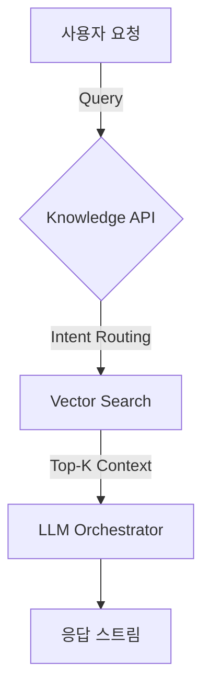

# AI 프로젝트 지식 기반 서비스

Python / Celery 를 이용하여 파일 업로드 등의 요청을 받는 FastApi 와 indexing (Embedding) Pipeline 을 엮고, 지식 소스들의 묶음을 조직별로 활용할 수 있는 지식 기반 서비스를 구축했습니다.

프로젝트의 주요 컴포넌트는 RAG(Python)/Knowledge Api(Kotlin)/FE(TypeScript) 로 구성되어 있었으며,
본인 포함 실무 참여 인원은 4명 입니다. 

## 주요 포인트

- 리소스 효율화를 위한 튜닝 프로세스, 이슈 상황 확인 후 주말을 포함한 3일간의 튜닝을 거쳐 릴리즈
    - 과금 체계를 붙이기 전, document (특히 PDF)의 markdown 해석을 위한 각종 오픈소스 (9종) 에 대한 리서치와 분석, 평가 
    - PDF 의 경우 Random Access 가 필요하므로, 단순 스트리밍 처리가 어렵고, 이에 따라 프로젝트 전체에 메모리 튜닝을 위한 각종 최적화
    - 한정된 리소스에서 비용 절감을 위해 CPU / Memory Ephemeral Container 의 profiling 활용
    - C++ 에서의 메모리 관리에 대한 경험을(+ CS 지식, 게임서버 지식) 덧붙인 튜닝 가설의 설립과, 입증 및 개선 프로세스의 반복
- RAG 인프라 100%, Knowledge API 20% 직접 개발
- 

