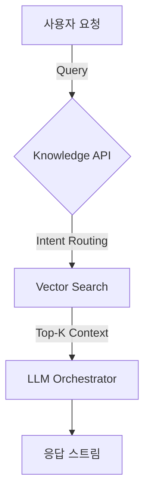

# AI 프로젝트 지식 플랫폼

RAG 파이프라인과 태스크별 워커를 엮어 지식 기반 서비스를 구축했습니다.

## 주요 포인트

- 수 GB 문서를 임베딩 가능한 청크로 분할하는 인입 워커 설계
- 1분 이내 피드백 루프를 위한 스트리밍 평가 워크플로 보유
- RAG 인프라 100%, Knowledge API 20% 직접 개발

```mermaid
graph TD
  A[사용자 요청] -->|Query| B{Knowledge API}
  B -->|Intent Routing| C[Vector Search]
  C -->|Top-K Context| D[LLM Orchestrator]
  D --> E[응답 스트림]
```

