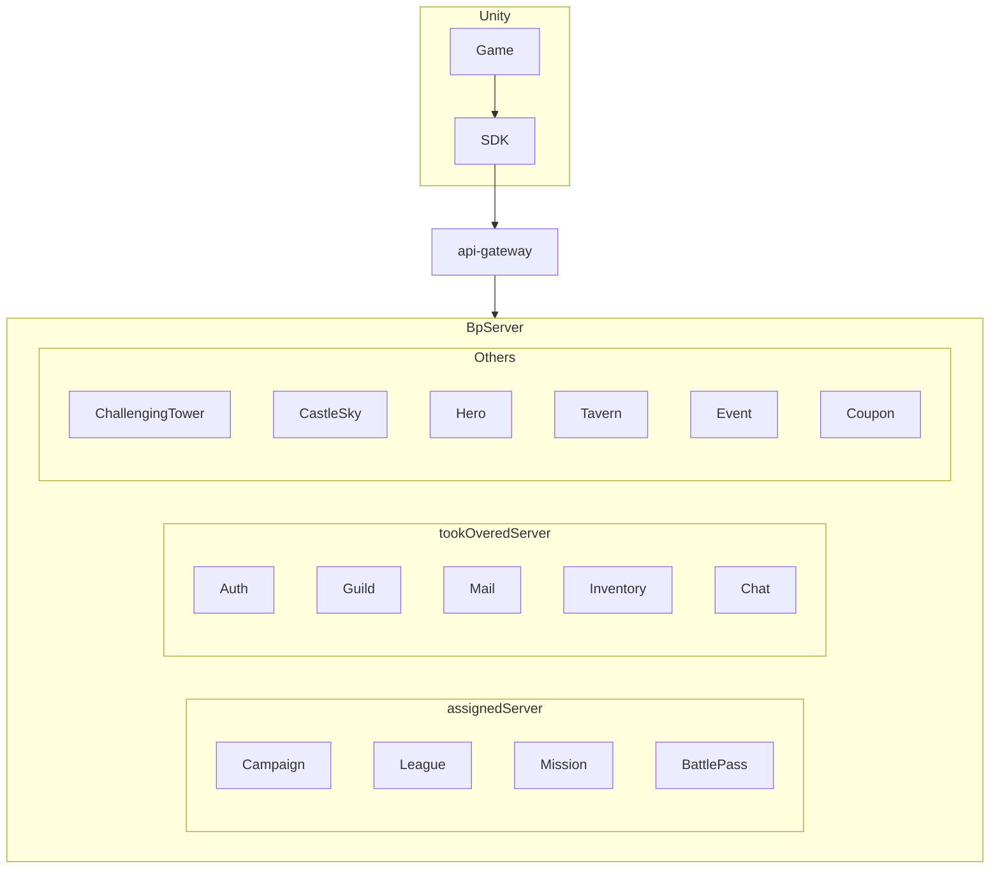

# BrownDust Puzzle

Neowiz 의 브라운 더스트 IP 를 활용한 3 Match 퍼즐 RPG 게임.

당시 네오위즈 게임즈에서는 게임서버에서 공통으로 사용될 수 있는 부분들에 대해 경험을 재활용 할 수 있도록 신규 플랫폼을 구축하고자 했으며, 대표적으로 예를 들면

- 로그인/인증과 같이 공통적으로 필요한 기능 
- 상점, 쿠폰 서비스등 같이 일반적으로 구현이 필요한 기능  
- 단순 메서드/함수 호출로 서버와 통신 하는 SDK 
- 게임 특화 로직만 별도 pluggable 하게 교체 가능한 플랫폼

콘텐츠 적인 요소도 있었기 때문에 플랫폼을 중심으로 개발해나가면 게임에서 실제로 사용하기 어려울 것이라는 내부 판단에 따라 신규 게임 프로젝트의 서버개발자로 분해 개발 진행.  

게임 콘텐츠를 직접 개발함.  
이 과정에서 다수의 MSA 서버들이 개발되었으며, 
`약 20 여개`의 서비스들이 본 게임을 위해 구동됨.

참여 백엔드 개발자는 본인 포함 3명, SDK 의 담당자이기도 했기에(For Unity), 다른 담당자의 콘텐츠 로직 커뮤니케이션 외에 플랫폼 적인 커뮤니케이션 담당.

## 주요 포인트

- `서버의 코드를 분석 (Roslyn Code Analysis) 하여 SDK 메서드 자동 생성`, Unity 게임 개발자는 SDK 를 Unity 에 붙이고 제공된 메서드 호출만으로 서버 통신

- 담당 기능의 게임 콘텐츠 개발 (Especially League)
    - 캠페인은 일반적인 스테이지 단위 게임 플레이/클리어 기능을 말함
    - 리그전의 경우 특정 시점을 기해 각 유저의 리그에 맞는 유저풀을 구성하고, 유저가 리그전 참여시 해당 유저 풀의 유저들끼리 매칭, 승점을 계산하여 다시 유저 리그를 구성하여 반복하는 기능을 말함

- `DevOps` 역할도 기여. 기존 dev 환경의 Terraform 구성을 수정 / 활용하여 신규 환경 Stage(QA) 환경 구성 및 기타 환경 유지 보수 (DevOps 에 비중이 좀 있는 프로젝트는 이 프로젝트가 두번째)

<!--  -->
