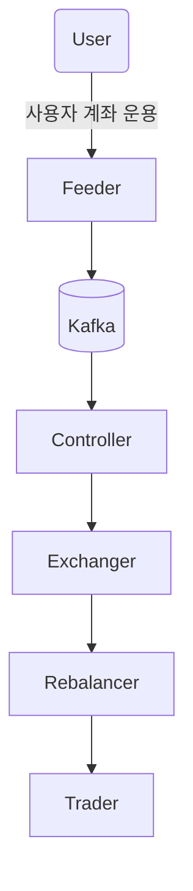

# 로보 어드바이저 트레이딩 서비스
주식 트레이딩에 관한한 수익성의 지표인 RATB 를 통과한 로보어드바이저 트레이딩 서비스 개발 

기존에 운영되고 있던 서비스가 batch 기반으로 app 외부에서 자유롭게 발생하는 HTS 의 이벤트를 정상적으로 핸들링하지 못해 다양한 에러가 발생하는 상황이었으며,  이를 해결하기 위해 기존 사내인력중 해결할 수 있는 인력으로 내부 Scout 된 케이스(As `PL`). Heybit -> dndn

새로 Architecting 한 프로젝트의 주요 Service는 Feeder, Controller, Rebalencer, Trader, Exchanger 로, 각각 명칭에 해당하는 역할을 수행 (Single Responsibility)하도록 Architecting 및 Implementation. 여기서 최초에는 Feeder 를 제외한 나머지 서비스들은 monolithic 로 빠르게 구현하였으며, Single Responsibility 를 위한 MSA 로의 수정은 이미 MSA 를 고려한 시스템이었으므로 - 단순 코드 이관 및 이미 잘 구축된 DevOps 의 서비스 추가건 이었으므로(Uprise 에서 기반 지식에 대한 인정으로 DevOps 의 권한이 어느정도 있었으므로), 각 서비스당 `하루가 넘지 않는 수준`에서 서비스 분리. (AI Code Assistant 의 도움이 있지는 않았던 시기)

프로젝트 참여 개발자는 8명 정도.

## 주요 포인트
- 기존에 배치 기반으로, 요청시기와 처리시기 사이에 인입되는 유저의 HTS 의 이벤트에 대해 처리하지 못하는 내용에 대한 대응 
- 동일 사유로 처리시와 요청시의 자산의 변경으로 자산 변동에 대해 적절히 처리하지 못하는 내용에 대해 신규 아키텍쳐의 구축을 통한 대응 
- 유저의 각종 계좌 변동 이벤트에 따른 처리
- 유저 자산 포트폴리오를 위한 리밸런싱 기능 구현
- 각 서비스에서 사용될 공통 모듈 구현

