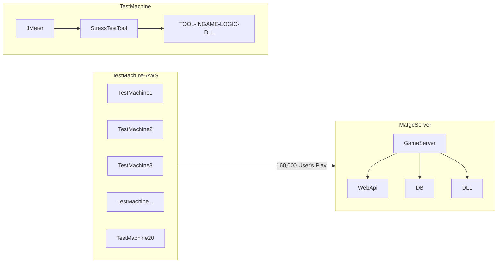

# 실시간 게임서버 / 전 그룹사 인프라 이전 프로젝트

On Premise 환경으로 구동 되던 Neowiz Group 의 서버들을 Cloud 환경으로 전체 이관하는 프로젝트.
그 중 당시 네오위즈에서 많은 매출 비중을 보유하고 있던 모바일 웹보드 서버 플랫폼 이전에 관한한 공동 PL 로 참여.  본 프로젝트 이전에 해당 게임서버의 Main Contributor 였으므로 어떤 부분이 수정되어야 할지나, 어떻게 통합테스팅을 진행해야 할지 등에 대한 전반적인 지식이 있었으므로, 실제 운영되는 유저의 패턴을 기존에 수집한 metric 을 활용하여 유저가 실제로 플레이하는 패턴/트래픽으로 동적 시나리오 구성/구현.

Stateful 한 게임 서버이므로 유저의 실제 트래픽 패턴이 실제 동작성에 많은 영향을 미칠 수 있으므로 필요한 분석이었으며, 게임 서버의 콘텐츠 로직이 Web Api 로 구성된 것도 있었으나, 소켓기반 통신이 필요하며, 실제 게임 룸 로직은 DLL 로 구성되어 일반적인 스트레스테스팅 툴로는 분석이 불가.  하여 분산 스트레스테스팅 툴도 직접 구현.

본 웹보드 인프라 이전 프로젝트 참여 유관 인력은 < 200 명 정도, `Co-PL` 로 참여. 게임플레이 관련한 검증 100% 담당.

실제 트래픽의 부하를 새 인프라에서 '정상적' 으로 게임플레이가 가능한지 확실하게 검증하고자 하였으므로, MCU (동시 접속자 수) 16만의 traffic 을 스트레스 테스팅 툴에서 구동.

테스트 환경 구성 과정에서도 트래픽을 많이 넣어야하다보니 클라이언트 단에서 부하를 못넣는 이슈 등도 있었으며, JMeter 사용 패턴 분석 및 스트레스 테스팅 툴 프로파일링을 통해 일정내 이슈 해소 (Context Switch Issue).
해당 이슈들의 원인 분석 및 해소도 직접 진행.
